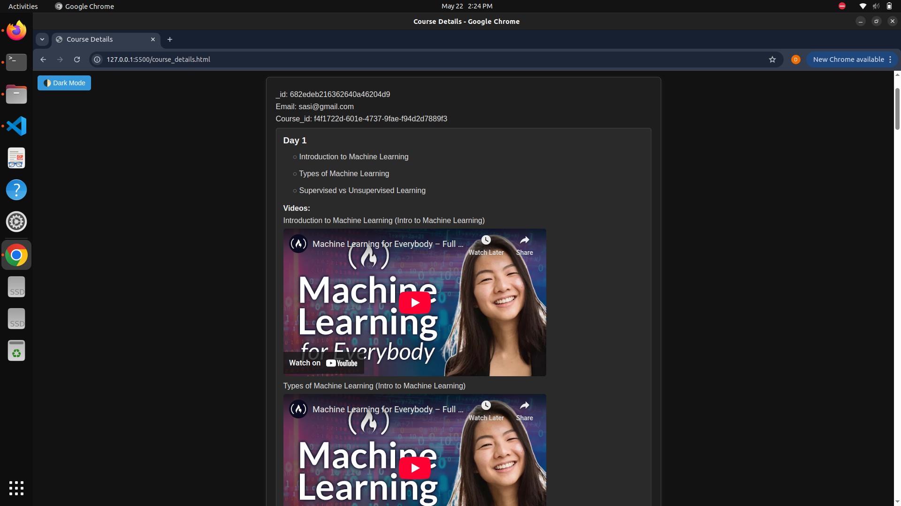
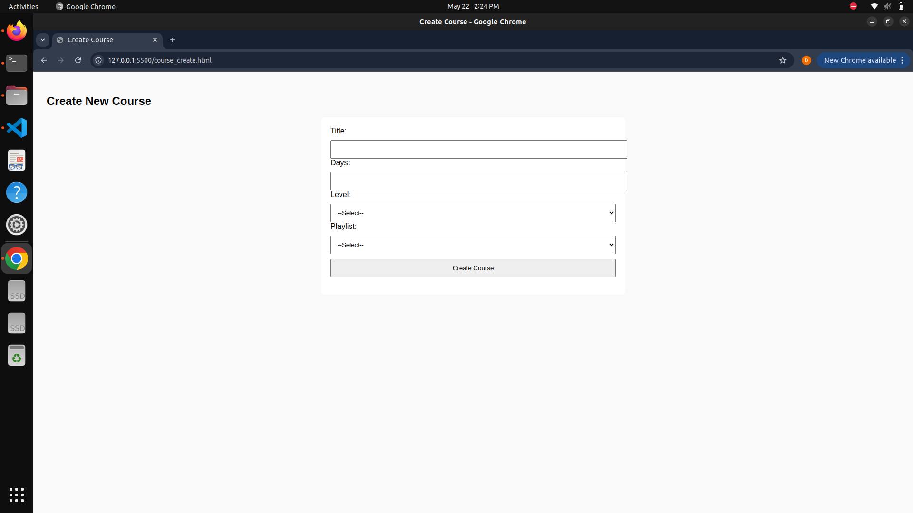
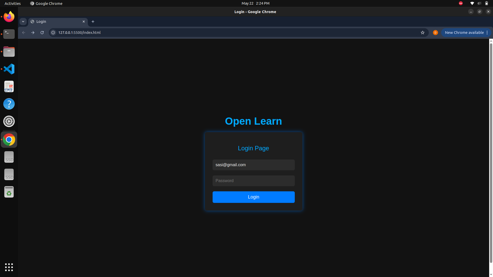
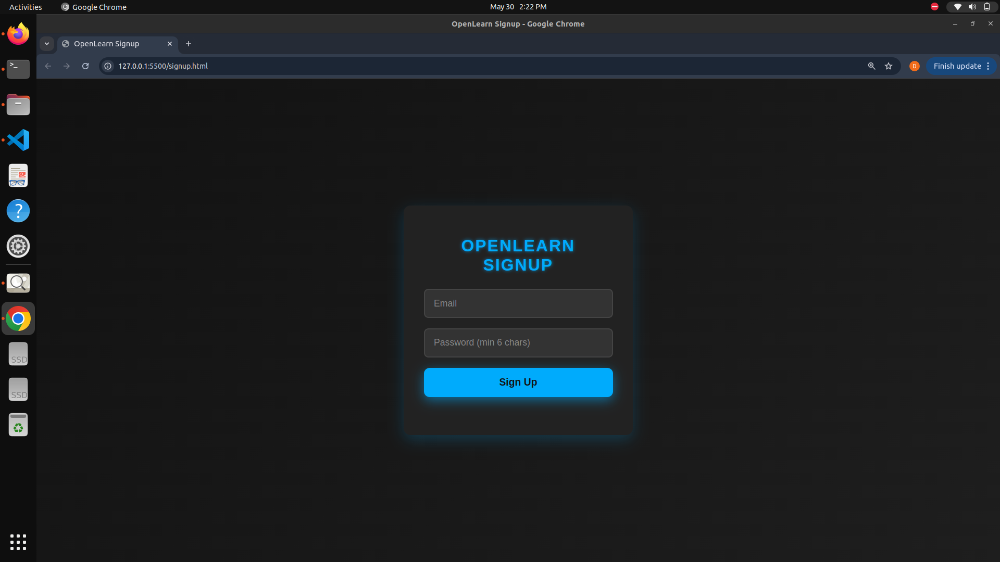
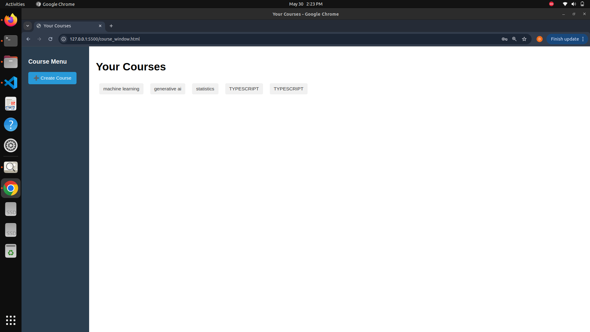
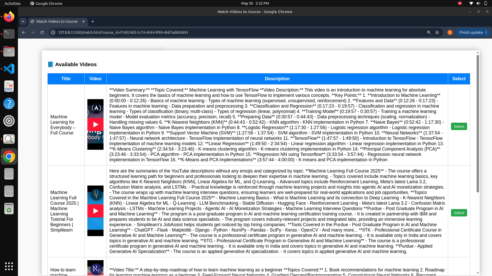

<p align="center">
  
</p>

<h1 align="center">Open Learn 📚🚀</h1>

<p align="center">
  <b>AI-powered personalized learning platform</b><br>
  Transform open resources into structured lessons with progress tracking, gamification, and adaptive learning.
</p>

---

## ✨ Features

- 🧠 **AI-Generated Study Material** – Converts open-source content into structured lessons.
- 🔥 **Personalized Learning Paths** – Adapts to your learning speed and interests.
- 🏆 **Gamification** – Stay motivated with badges, streaks, and rewards.
- 📊 **Progress Tracking** – Visual dashboards to monitor your learning journey.
- ♻️ **Reinforcement Learning Techniques** – Smart review and feedback cycles.
- 🌐 **Open Source** – Built from open educational resources, accessible to all.

---

## 📸 Screenshots

| Dashboard | Lesson View |
|------------|--------------|
|  |  |

| Progress Tracking | Gamification Example |
|-------------------|-----------------------|
|  |  |

| Mobile View |
|--------------|
|  |

---

## 🛠️ Tech Stack

- 🧠 **AI Backend:** Groq (Llama models via Groq API)
- 🌐 **Frontend/UI:** HTML, CSS, JavaScript
- ⚙️ **Backend:** FastAPI / Node.js
- ☁️ **Database:** MongoDB
- 🎨 **Design:** Pure CSS

---

## 🚀 Getting Started

### 1. Clone the Repository

```bash
git clone https://github.com/your-username/open-learn.git
cd open-learn
